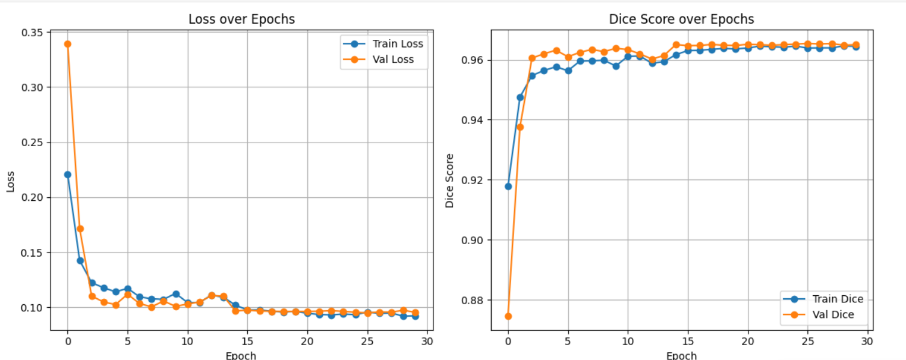
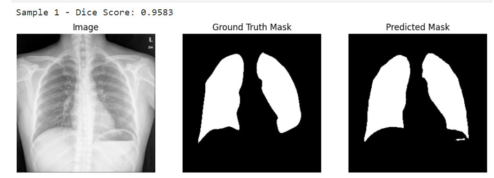

# 🫁 Lung Segmentation Project

This project performs **lung segmentation** from chest X-ray images using **UNet++** with a **pre-trained EfficientNet-B0 encoder**.  
It is trained on a combination of **Montgomery and Shenzhen datasets**.  
Images and masks are stored in `dataset/img` and `dataset/mask`.

---

## 📌 Table of Contents
- [Dataset](#-dataset)
- [Metrics](#-metrics)
- [Results](#-results)
- [Features & Notes](#-features--notes)

---

## 📂 Dataset

We combine two datasets for training and evaluation:  
- **Montgomery**  
- **Shenzhen**

Each image has a corresponding mask with the same filename.

---

## 🎯 Metrics

- **Dice Score:** Measures overlap between predicted mask and ground truth (0–1).  
- **Loss:** Combined **Binary Cross-Entropy (BCE) + Dice Loss**.  

Higher Dice Score = better segmentation.

---

## 📈 Results

### Training Progress
**Loss and Dice Score over epochs**:

### Final Test Results
- **Test Loss:** `0.0927`  
- **Test Dice Score:** `0.9655`  

### Test Samples
Predictions on test images:

---

## ⚡ Features & Notes

- Supports **data augmentation** for robust training.  
- Works on **grayscale X-ray images**, resized to 256x256.  
- Dice Score 1.0 = perfect prediction.  
- Easily extendable to other datasets or architectures.  
- Best model saved as `best_model.pth`.
